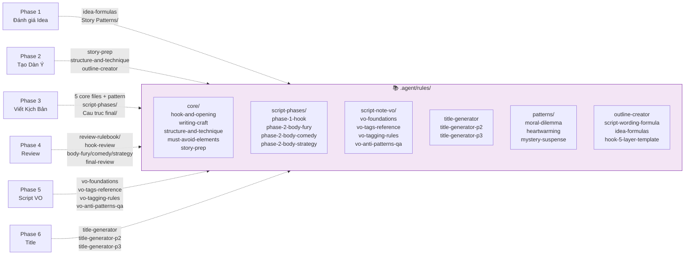
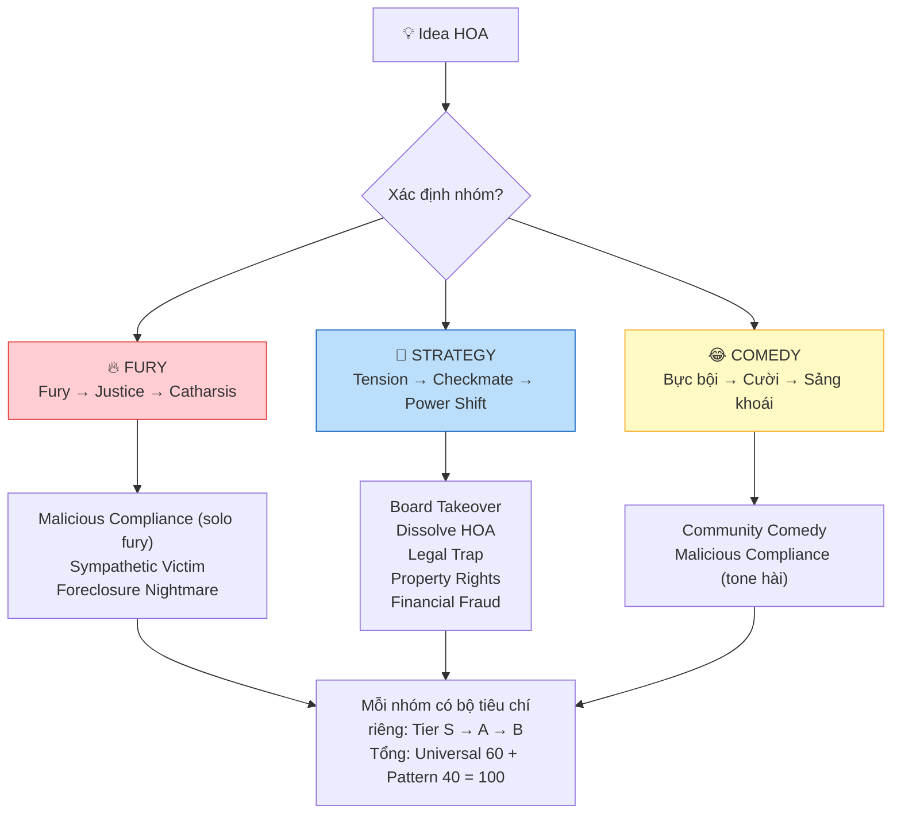

# 🗺️ Sơ Đồ Pipeline — Từ Idea → Video

## Tổng quan luồng chạy

```mermaid
flowchart TD
    START["💡 User cung cấp Idea\n(mô tả / link Reddit / concept)"] --> P1

    subgraph P1["PHASE 1 — 🧠 Đánh giá Idea (~20 phút)"]
        direction TB
        P1A["/danh-gia-idea\nXác định pattern\nChấm Universal 60đ"] --> P1B["/danh-gia-idea-p2\nChấm Pattern-Specific 40đ\nRed Flags + Verdict"]
    end

    P1 --> P1Check{"Điểm ≥ 70?"}
    P1Check -- "❌ < 70" --> P1Fail["Chọn idea khác\nhoặc user chấp nhận"]
    P1Fail --> P1
    P1Check -- "✅ ≥ 70" --> P1Out["📄 Ideas/Category/\nIdea-slug-V1.md"]

    P1Out --> WAIT1["⏸️ DỪNG — User duyệt"]
    WAIT1 --> P2

    subgraph P2["PHASE 2 — 📝 Tạo Dàn Ý (~45 phút)"]
        direction TB
        P2A["Step 1: Story Prep\nCharacter Blueprint\nStory Inventory Mining"] --> P2W["⏸️ User xác nhận prep"]
        P2W --> P2B["Step 2: Mini Arc Map\nRetention Hook Map\nEmotional Ladder"]
    end

    P2 --> P2Out["📄 Dan Y/PATTERN/\nOutline-slug-V1.md"]
    P2Out --> WAIT2["⏸️ DỪNG — User duyệt"]
    WAIT2 --> P3

    subgraph P3["PHASE 3 — ✍️ Viết Kịch Bản (~90 phút)"]
        direction TB
        P3A["Đọc 5 core rules + pattern"] --> P3B["Viết Script EN\n~3000-4000 từ"]
        P3B --> P3C["Dịch → Script VI"]
    end

    P3 --> P3Out["📄 Kich Ban/EN/ + VI/\nScript-slug-V1.md"]
    P3Out --> WAIT3["⏸️ DỪNG — User duyệt"]
    WAIT3 --> P4

    subgraph P4["PHASE 4 — 🔍 Review + Sửa (~45 phút)"]
        direction TB
        P4A["/review\nUniversal A-H\nPattern-Specific D-F"] --> P4Check{"Verdict?"}
        P4Check -- "✅ Đạt" --> P4Pass["Giữ V1"]
        P4Check -- "⚠️ Cần sửa" --> P4Fix["Áp dụng fixes\n→ Script V2 EN + VI"]
    end

    P4 --> P4Out["📄 Review/Review-slug.md\n+ Script V2 (nếu sửa)"]
    P4Out --> WAIT4["⏸️ DỪNG — User duyệt"]
    WAIT4 --> P5

    subgraph P5["PHASE 5 — 🎤 Tạo Script VO (~45 phút)"]
        direction TB
        P5A["Emotional Arc Map\nVillain Evolution\nSacred Phrases"] --> P5B["Clean text + Chia segments\n≤800 từ/file"] --> P5C["Gắn ElevenLabs tags\n+ QA Checklist"]
    end

    P5 --> P5Out["📄 Process VO/slug/\nScript-Note-slug.txt"]
    P5Out --> WAIT5["⏸️ DỪNG — User duyệt"]
    WAIT5 --> P6

    subgraph P6["PHASE 6 — 🎬 Tạo Title (~30 phút)"]
        direction TB
        P6A["Extract elements từ Script"] --> P6B["Generate 5 Title Options\nScore + Recommend"] --> P6C["Gợi ý Thumbnail"]
    end

    P6 --> DONE["✅ PIPELINE HOÀN THÀNH"]

    style START fill:#4CAF50,color:#fff,stroke:#2E7D32
    style DONE fill:#4CAF50,color:#fff,stroke:#2E7D32
    style P1Check fill:#FFF9C4,stroke:#F9A825
    style P4Check fill:#FFF9C4,stroke:#F9A825
    style P1Fail fill:#FFCDD2,stroke:#E53935
    style WAIT1 fill:#E3F2FD,stroke:#1565C0
    style WAIT2 fill:#E3F2FD,stroke:#1565C0
    style WAIT3 fill:#E3F2FD,stroke:#1565C0
    style WAIT4 fill:#E3F2FD,stroke:#1565C0
    style WAIT5 fill:#E3F2FD,stroke:#1565C0
```

---

## Rules & Files mỗi Phase đọc

---

## Cấu trúc output theo thư mục

| Phase | Output | Thư mục |
|-------|--------|---------|
| 1 — Đánh giá | `Idea-slug-V1.md` | `Ideas/[Category]/` |
| 2 — Dàn ý | `Outline-slug-V1.md` | `Dan Y/[PATTERN]/` |
| 3 — Kịch bản | `Script-slug-EN-V1.md` + `Script-slug-VI-V1.md` | `Kich Ban/EN/[PATTERN]/` + `VI/` |
| 4 — Review | `Review-slug-V1.md` + Script V2 (nếu sửa) | `Review/` + `Kich Ban/` |
| 5 — VO | `Script-Note-slug.txt` | `Process VO/[slug]/` |
| 6 — Title | 5 gợi ý + Thumbnail | `Title/` (hoặc trong conversation) |

## Skip Rules

| Đã có sẵn | Bắt đầu từ |
|-----------|------------|
| File Idea ✅ | Phase 2 |
| File Outline ✅ | Phase 3 |
| File Script ✅ | Phase 4, 5, hoặc 6 |
| Chỉ cần VO | Phase 5 only |
| Chỉ cần Title | Phase 6 only |

> User nói: `"chạy full-pipeline từ Phase X"` hoặc `"đã có outline [file]"` để skip.

---

## 3 Nhóm Pattern

